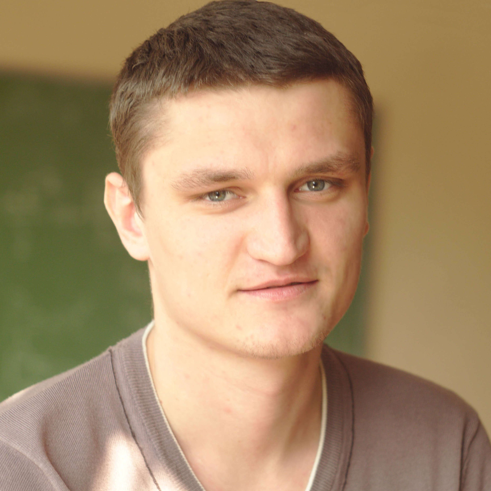
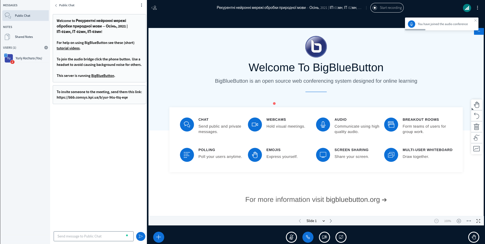
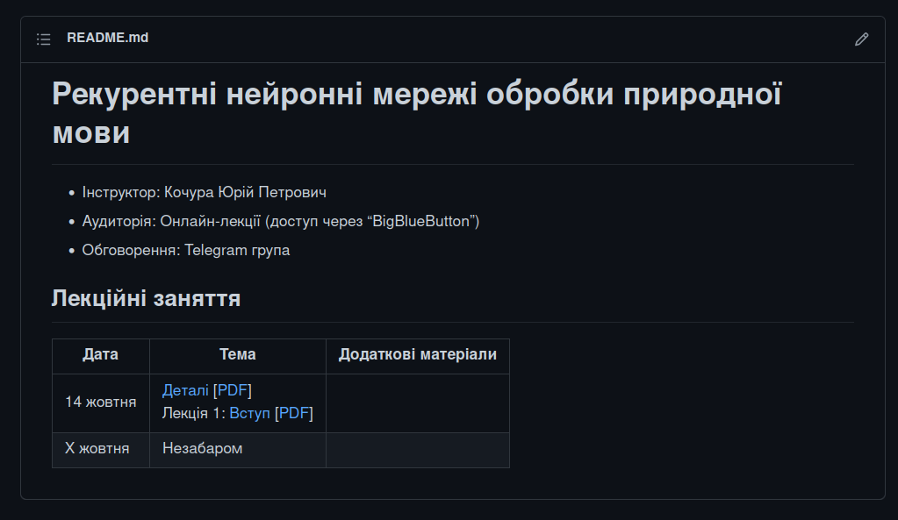
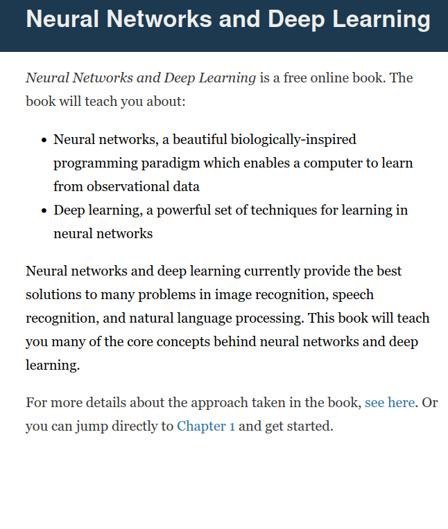
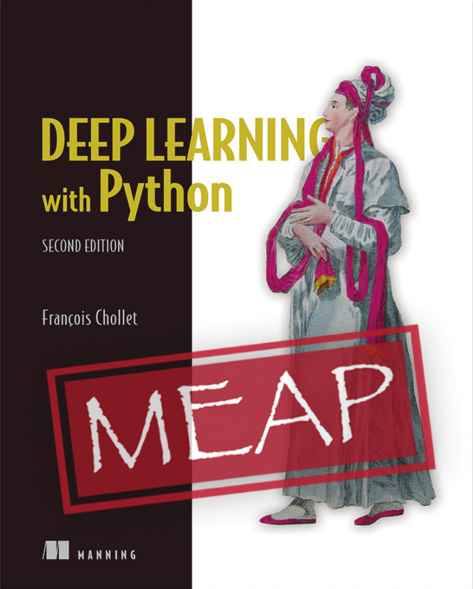
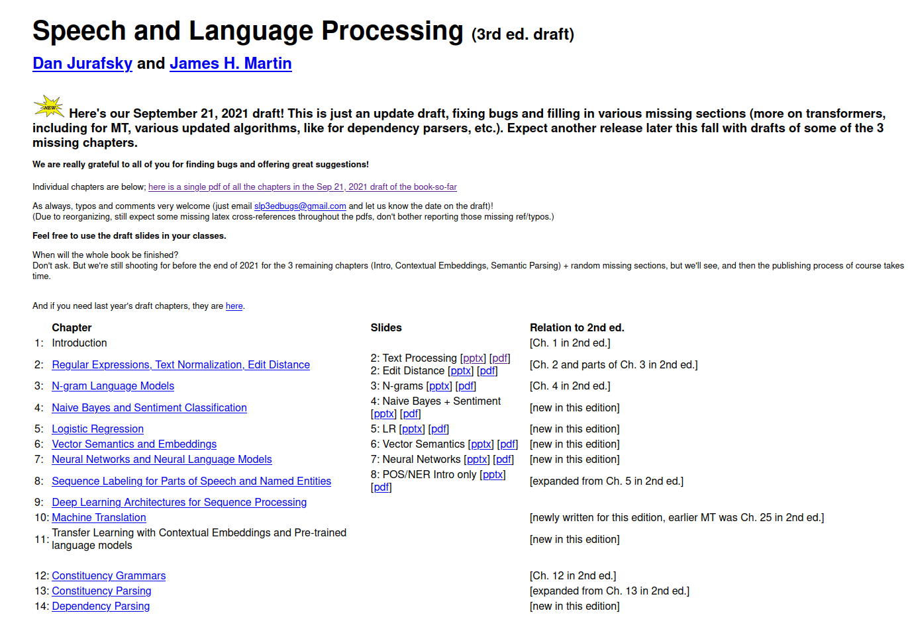
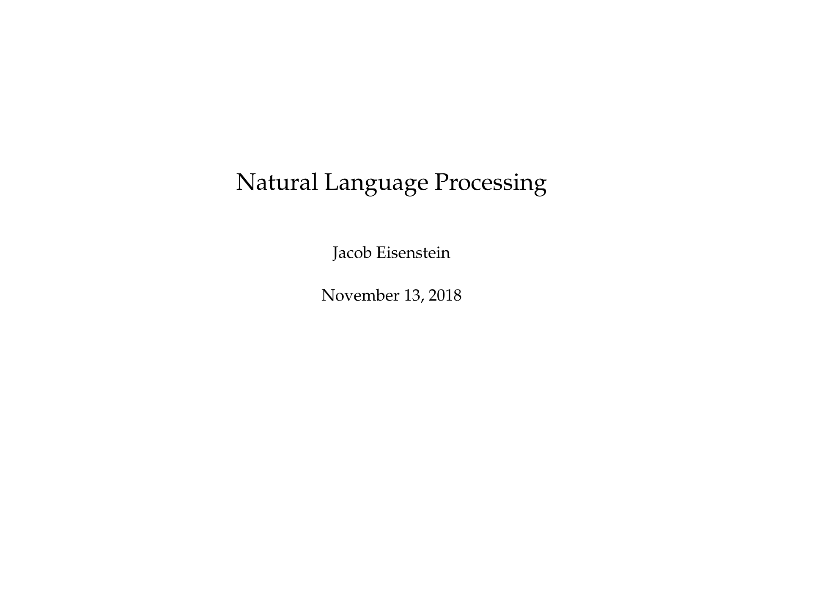
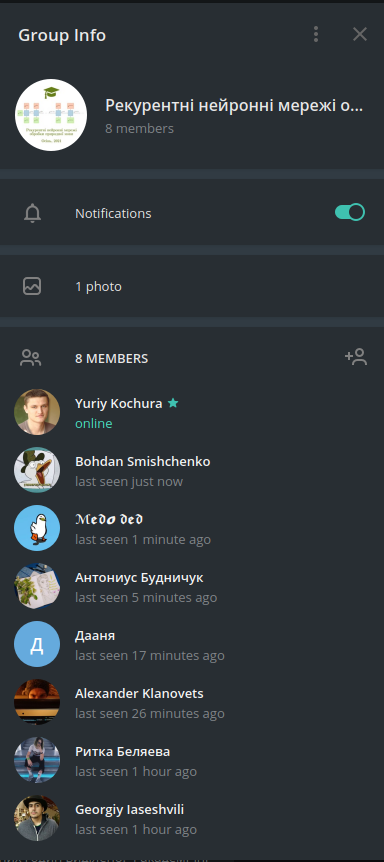

class: middle, center, title-slide 

# Рекурентні нейронні мережі обробки природної мови

Осінь, 2021

  
Кочура Юрій Петрович 
[iuriy.kochura@gmail.com](mailto:iuriy.kochura@gmail.com)  
<a href="https://t.me/y_kochura">@y_kochura</a>  

---

# Інструктор

Лекції
- Кочура Юрій Петрович
  - Кафедра ОТ, ФІОТ

 

.center[
.circle.width-40[]
]

---

class: middle

# Опис

Деталі

- Будуть розглянуті такі види архітектур рекурентних мереж: *one-to-one, one-to-many, many-to-one, many-to-many*
- Познайомитесь з задачами приктичного застосування цих архітектур

---

# Аудиторія

Цього семестру (Осінь 2021) заняття проходять онлайн в .bold[*BigBlueButton*] за посиланням:  [https://bbb.comsys.kpi.ua/b/yur-96u-ttq-eqe](https://bbb.comsys.kpi.ua/b/yur-96u-ttq-eqe)

.center.width-90[]

---

class: middle 

# Матеріали лекцій

Матеріали лекцій розміщені за посиланням [https://github.com/YKochura/rnn-kpi](https://github.com/YKochura/rnn-kpi)

- Надається у HTML та PDF

.center.width-80[]

---

class: middle

# Підручники - ГН

 Можливо, Вам стане в нагоді одна з цих книг, яка дасть Вам можливість більш детально ознайомитись з передовими темами глибинного навчання:

.smaller-xx.grid[
.kol-1-3[
[.center.width-80[]](https://www.deeplearningbook.org/)
.center[Безкоштовна -EN]
]

.kol-1-3[
[.center.width-95[]](http://neuralnetworksanddeeplearning.com/index.html)
.center[Безкоштовна -EN]
]

.kol-1-3[
[.center.width-80[]](https://www.manning.com/books/deep-learning-with-python-second-edition?query=deep/)
.center[Безкоштовний перегляд -EN]
  ]
]

---

class: middle

# Підручники - РМ

 Деякі корисні матеріали, які можуть стати Вам у нагоді при опануванні рекурентних нейронних мереж для задач обробки природної мови:

.smaller-xx.grid[
.kol-1-2[
[.center.width-110[]](https://web.stanford.edu/~jurafsky/slp3/)
.center[Безкоштовна -EN]
]

.kol-1-2[
[.center.width-120[]](https://github.com/jacobeisenstein/gt-nlp-class/blob/master/notes/eisenstein-nlp-notes.pdf)
.center[Безкоштовна -EN]
]

]

---

class: middle

# Обговорення

.smaller-xx[Усі оголошення та обговорення матеріалів лекцій здійснюватиметься в Telegram (повідомте мене, якщо Вас потрібно додати в цю групу)

- Задавайте питання, які Вас турбують. 
- Не соромтесь!
]

.center.width-25[]

---

class: middle

# Оцінювання

- 20%  &nbsp;&emsp; Присутність на лекціях (10% кожна)
- 80%  &nbsp;&emsp; Залік (контрольна)
---

class: end-slide, center
count: false

.larger-xx[Почнемо!]