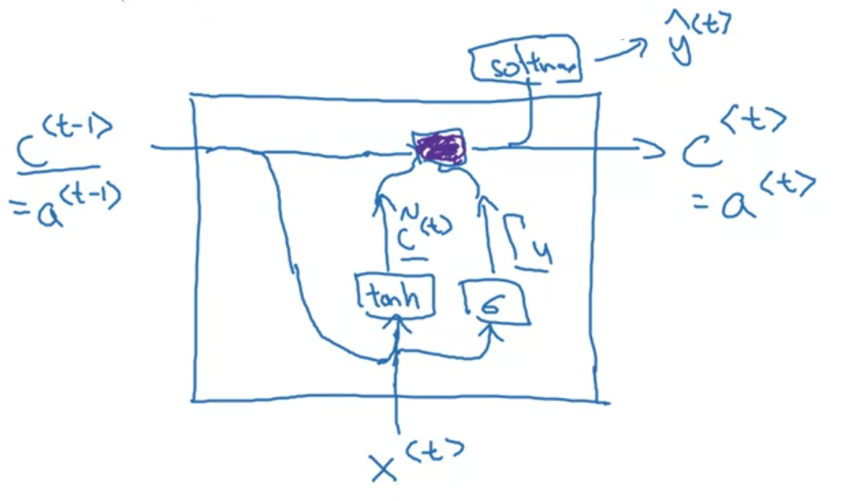

class: middle, center, title-slide 

# Рекурентні нейронні мережі обробки природної мови

Лекція 1-2: Рекурентні нейронні мережі (вступ)

  
Кочура Юрій Петрович 
[iuriy.kochura@gmail.com](mailto:iuriy.kochura@gmail.com)  
<a href="https://t.me/y_kochura">@y_kochura</a>  

???
Рекуре́нтні нейро́нні мере́жі (РНМ, англ. recurrent neural networks, RNN) &mdash; це клас штучних нейронних мереж, у якому з'єднання між вузлами утворюють граф орієнтований у часі. Це створює внутрішній стан мережі, що дозволяє їй проявляти динамічну поведінку в часі. На відміну від нейронних мереж прямого поширення, РНМ можуть використовувати свою внутрішню пам'ять для обробки довільних послідовностей входів. Це робить їх застосовними до таких задач, як розпізнавання несегментованого неперервного рукописного тексту, розпізнавання мовлення тощо.

Почнемо з кількох прикладів того, де рекурентні мережі можуть бути корисними. 

---

class: middle

# Сьогодні

- Будова RNNs
- Пряме та зворотне поширення в RNNs
- Типи RNNs
- Створення мовної моделі
- Створення вибірки послідовностей
- Проблема зникаючого градієнта
- GRU and LSTM

---

class: middle

# Приклади послідовностей

.center[
.width-100[]
]

.footnote[Джерело слайду: [Sequence Models](https://www.coursera.org/learn/nlp-sequence-models) [[video](https://www.coursera.org/learn/nlp-sequence-models/lecture/0h7gT/why-sequence-models)], Andrew Ng et al.]

???
Моделі послідовності (Sequence models) &mdash; це моделі машинного навчання, які обробляють або видають результат у вигляді послідовності даних. До послідовностей даних відносяться текстові потоки, аудіокліпи, відеокліпи, дані часових рядів тощо. 

Такі моделі, як рекурентні нейронні мережі або RNN, трансформували розпізнавання мовлення, обробку природної мови та інші області глибинного навчання.

Приклади моделювання послідовностей даних. Розпізнавання мови. Вхід, позначений x, аудіо сигнал. Вихід, позначений y, речення: the quick brown fox jumped over the lazy dog.

І вхід, і вихід тут є послідовностями, оскільки X є аудіокліпом, і тому він відтворюється з часом, а Y, вихід, є послідовністю слів. Таким чином, моделі послідовностей, такі як рекурентні нейронні мережі та інші варіації, про які ви дізнаєтеся трохи пізніше, є дуже корисними для розпізнавання мови. 

Генерація музики. Вхід, відсутній, жанр музики або кілька перших нот. Вихід, послідовність нот. У цьому випадку лише вихід Y є послідовністю, вхідом може бути порожній набір, або це може бути одне ціле число, яке вказує на жанр музики, який ви хочете створити, або, можливо, перші кілька нот музичного твору, який ми хочемо згенерувати. 

Аналіз тональності тексту (Sentiment classification). Вхід, речення "there is nothing to like in this movie." Вихід, оцінка одна зірка з п'яти.

ДНК аналіз. Вхід, рядок нуклеотидів: A, G, C і T. Вихід, той самий рядок, з підпослідовністю, виділеною червоним. Таким чином, за допомогою послідовності ДНК ви можете позначити, яка частина цієї послідовності ДНК відповідає білку. 

Машинний переклад (Machine translation). Вхід, речення французькою. Вихід, його англійський переклад: do you want to sing with me?

Розпізнаваня активності з відео (Video activity recognition). Вхідні дані -- чотири кадри з відео. Вихід -- опис активності (біг).

Розпізнавання іменованих сутностей (Name entity recognition). Під час розпізнавання іменованих сутностей Вам можуть дати речення та попросити ідентифікувати людей у цьому реченні.  

Усі ці проблеми можна вирішувати у рамках навчання з учителем (контрольованого навчання) із вхідними даними та мітками (X та Y) як навчальним набором. Але, як ви можете зрозуміти з поданих вище прикладів, існує багато різних типів задач з послідовностями. 

У деяких задачах вхід X та вихід Y є послідовностями, і в деяких задачах X і Y можуть мати різну довжину, або як в цьому прикладі X і Y мають однакову довжину. І в деяких із цих задач лише X або лише Y є послідовністю. 

---

class: middle

# Позначення

.center[
.width-100[]
]

.grid[
.smaller-xx.kol-1-2[
- $T\_x = 9$ &mdash; довжина вхідної послідовності
- $T\_y = 9$ &mdash; довжина вихідної послідовності
- $T^{(i)}\_x $ &mdash; вхідна довжина $i$-го  прикладу
- $T^{(i)}\_y $ &mdash; вихідна довжина $i$-го  прикладу
]

.smaller-xx.kol-1-2[
- $x^{(i)}$ &mdash; $i$-й навчальний приклад
- $x^{(i)\langle t \rangle}$ &mdash; $t$ елемент $i$-го навчального прикладу
- $y^{(i)}$ &mdash; істинна мітка для $i$-го навчального приклад
- $\hat y^{(i)}$ &mdash; вихід для $i$-го навчального приклад
- $\hat y^{(i)\langle t \rangle}$ &mdash; $t$ елемент на виході для $i$-го навчального прикладу
]
]

.footnote[Джерело слайду: [Sequence Models](https://www.coursera.org/learn/nlp-sequence-models) [[video](https://www.coursera.org/learn/nlp-sequence-models/lecture/aJT8i/notation)], Andrew Ng et al.]

???

Зараз це наша перша серйозна спроба NLP або обробки природної мови. І одна з речей, яку ми маємо вирішити, &mdash; як представити окремі слова в послідовності. Отже, як ми можемотаке подати слово, наприклад, Harry, і чому насправді має бути рівне $x^{\langle 1 \rangle}$? Далі поговоримо про те, як ми можемо представити окремі слова в реченні. 

---

class: middle

# Представлення слів

.center[
.width-100[]
]

.footnote[Джерело слайду: [Sequence Models](https://www.coursera.org/learn/nlp-sequence-models) [[video](https://www.coursera.org/learn/nlp-sequence-models/lecture/aJT8i/notation)], Andrew Ng et al.]

???
Отже, щоб представити слово в реченні, перше, що потрібно зробити &mdash; це створити словник. Тут лівий крайній стовпець (масив) називають словник (Vocabulary) інколи Dictionary, що означає складання списку слів, які ви будете використовувати у своїх представленнях. Наприклад, створимо такий словний, де першим словом словника є "a". Друге слово &mdash; *Aaron*, а трохи нижче ще інші йдуть слова,  і зрештою, ви потрапите до слів Harry, потім до слова *Potter*, а потім аж до останнього слова в словнику &mdash; *Bob*.  Harry з'являється на позиції 4075, Potter на позиції 6830, а Bob є останнім словом у словнику.

У цьому прикладі ми використовуємо словник розміром 10 000 слів. Це досить мало для реальних задач NLP. Для комерційних додатків NLP, розміри словників від 30 000 до 50 000 є більш поширеними, проте словники на 100 000 слів не є рідкістю. Деякі великі інтернет-компанії будуть використовувати словники розміром, який може бути мільйон слів або навіть більшим. Але багато комерційних додатків використовують словники розміром, від 30 000 до 50 000 слів.

Отже, якщо ви вибрали словник із 10 000 слів, і одним із способів створити цей словник буде перегляд ваших навчальних наборів і пошук 10 000 найпопулярніших слів, також перегляньте деякі онлайн-словники, які підкажуть вам, які найбільше слова є найбільш вживані.

Для представлення кожного з слів ви можете зробити унітарний код (one-hot). Наприклад, $x^{\langle 1 \rangle}$, який позначає слово Harry, буде вектором з усіма нулями, за винятком 1 в позиції 4075, тому що це була позиція слова Harry в словнику. 

Метою цього представлення *x* є можливість вивчити відображення вхдіної послідовності *x* у вихдіну *y*. Це є навчанням з учителем.

Остання деталь, про яку ми докладніше поговоримо: що, якщо ви зіштовхнетесь зі словом, якого немає у вашому словнику? Відповідь полягає в тому, що ви можете створити новий токен або нове вигадане слово під назвою Unknown Word, і повертаєтеся назад як UNK. Як представляти слова, яких немає у вашому словнику, ми поговоримо більше про це пізніше. 

---

class: middle

# Чому не стандартна мережа? 

.center[
.width-100[]
]

## Проблеми
- Входи та виходи можуть мати різну довжину для різних прикладів
- Не поширює ознаки вивчені у різних позиціях тексту

.footnote[Джерело слайду: [Sequence Models](https://www.coursera.org/learn/nlp-sequence-models) [[video](https://www.coursera.org/learn/nlp-sequence-models/lecture/ftkzt/recurrent-neural-network-model)], Andrew Ng et al.]

???
Тепер ви можете спробувати використовувати стандартну нейронну мережу для цього завдання. Отже, у нашому попередньому прикладі ми мали дев’ять вхідних слів. Отже, ви можете уявити, що намагаєтесь взяти ці дев’ять вхідних слів, можливо, дев’ять унітарно закодованих слів і подати їх у стандартну нейронну мережу, можливо, з кількома прихованими шарами, а потім,  отримати дев’ять значень нуль або одиницю, які показують вам чи є кожне слово частиною імені людини. Але виявляється, що це не працює добре, і насправді є дві основні проблеми, перша полягає в тому, що входи та виходи можуть мати різну довжину для різних прикладів. Це не було б проблемою, якби кожен приклад мав однакову вхідну довжину $T\_x$ та однакову вихідну довжину $T\_y$ або , можливо, кожне речення має максимальну довжину.  Можливо, ви могли б заповнювати або обнуляти кожен вхід до цієї максимальної довжини, але це не буде гарним представлення. Оскільки друга проблема, можливо, більш серйозна проблема полягає в тому, що така наївна архітектура нейронної мережі, як ця, не має спільного характеру, засвоєного в різних позиціях текстів. 

---

class: middle

# RNN &mdash; Many-to-many: $T\_x = T\_y$

.center[
.width-100[]
]

.footnote[Джерело слайду: [Sequence Models](https://www.coursera.org/learn/nlp-sequence-models) [[video](https://www.coursera.org/learn/nlp-sequence-models/lecture/ftkzt/recurrent-neural-network-model)], Andrew Ng et al.]

???
Ця архітектура RNN використовується для задач Name entity recognition. Рекурентні нейронні мережі, також відомі як RNN, є класом нейронних мереж, які дозволяють використовувати попередні вихідні дані як вхідні дані, маючи приховані стани.

Отже, якщо ви читаєте речення зліва направо, перше слово, яке ви прочитаєте буде  $x^{\langle 1 \rangle}$  і ми збираємося взяти це слово і передати його в шар нейронної мережі.  Є прихований шар першої нейронної мережі, і ми можемо запропонувати нейронній мережі спробувати передбачити вихід. Тобто чи є це слово частиною імені людини чи ні. І що робить рекурентна нейронна мережа, коли вона потім читає друге слово в реченні, скажімо, $x^{\langle 2 \rangle}$, замість того, щоб просто передбачити $\hat y^{\langle 2 \rangle}$, використовуючи лише $x^{\langle 2 \rangle}$, вона також отримує деяку інформацію отриману на попередньому етапі часу. Так, зокрема, обчислене значення активації з першого часового кроку передається на другий. Потім на наступному часовому кроці рекуррентна нейронна мережа приймає третє слово $x^{\langle 3 \rangle}$ і намагається вивести деяке передбачення $\hat y^{\langle 3 \rangle}$ і так далі до останнього часового кроку, де вона приймає $x^{\langle T\_x \rangle}$, а потім виводить $\hat y^{\langle T\_y \rangle}$. Принаймні в цьому прикладі $T\_x$ дорівнює $T\_y$, але  якщо $T\_x$ і $T\_y$ не ідентичні,  архітектура мережі трохи зміниться. Таким чином, на кожному кроці часу рекурентна нейронна мережа передається як активація до наступного часового кроку для подальшого використання.  

На часовому кроці нуль, активація є вектором з нулів. Деякі дослідники ініціалізують $a^{\langle 0 \rangle}$ випадковим чином. Ви можете ініціалізувати $a^{\langle 0 \rangle}$ і іншими способами, але ініціалізація нульовим вектором є найпоширенішим вибором.

Параметри, які використовує RNN для кожного кроку часу є спільними (shared). Отже, в цій рекуррентній нейронній мережі це означає, що, здійснюючи передбачення для $\hat y^{\langle 3 \rangle}$, мережа отримує інформацію не тільки від $x^{\langle 3 \rangle}$, але також інформацію від $x^{\langle 1 \rangle}$ і $x^{\langle 2 \rangle}$, щоб допомогти в передбаченні з $\hat y^{\langle 3 \rangle}$. Одним з недоліків цієї RNN є те, що вона використовує лише інформацію, яка знаходиться попереду в послідовності, щоб зробити передбачення. Зокрема, при прогнозуванні $\hat y^{\langle 3 \rangle}$ RNN не використовує інформацію від $x^{\langle 4 \rangle}$, $x^{\langle 5 \rangle}$, $x^{\langle 6 \rangle}$ тощо. Цю проблему можуть вирішити двонаправлені (bi-directional) RNN. У нашому випадку розглядається однонаправлена архітектура нейронної мережі, якої  буде достатньо, щоб пояснити ключові поняття. 

---

class: middle, 

# Пряме поширення
.center[
.width-80[]
]
.smaller-x[Для кожного часового кроку  $t$ активація $a^{\langle t \rangle}$ і вихід $y^{\langle t \rangle}$ виражаються таким чином: 

$$\boxed{\begin{aligned}a^{\langle t \rangle} &= g\_1(W\_{aa} a^{\langle t-1 \rangle} + W\_{ax}x^{\langle t \rangle} + b\_a) \\\\
\hat y^{\langle t \rangle} &= g\_2(W\_{ya} a^{\langle t \rangle} +  b\_y)
 \end{aligned}}$$

]

.footnote[Джерело слайду: [Sequence Models](https://www.coursera.org/learn/nlp-sequence-models) [[video](https://www.coursera.org/learn/nlp-sequence-models/lecture/ftkzt/recurrent-neural-network-model)], Andrew Ng et al.]

???
Залежно від того, який очікується тип передбачення RNN $\hat y$, якщо це задача бінарної класифікації, ви б використали сигмоїду для активації виходу, або це може бути softmax, якщо ви вирішуєте багатокласову задачу класифікації (k класів). 

У модулі RNN для обчислення ативації $a^{\langle t \rangle}$ зазвичай використовують в якості $g\_1$ tanh, ця ативаційна функція  дозволяє запобігти проблемі зникаючого градієнта, про яку ми поговоримо пізніше.

Для завдання name entity recognition, на виході моделі очікується отримати $\hat y$ 0 або 1, тому другу ативацію $g\_2$ можа обрати сигмоїду. 

Ці рівняння визначають пряме поширення в RNN. 

---

class: middle, 

# Загальновживані активаційні функції
.center[
.width-100[]
]

.footnote[Джерело слайду: [Sequence Models](https://www.coursera.org/learn/nlp-sequence-models) [[video](https://www.coursera.org/learn/nlp-sequence-models/lecture/ftkzt/recurrent-neural-network-model)], Andrew Ng et al.]

???
На цьому слайді подано найпоширеніші функції активації, які використовуються в модулях RNN.

---

class: middle, 

# Спрощення позначеннь в RNN
.center[
.width-100[]
]

$\hat y^{\langle t \rangle} = g(w\_{y} a^{\langle t \rangle} +  b\_y)$

.footnote[Джерело слайду: [Sequence Models](https://www.coursera.org/learn/nlp-sequence-models) [[video](https://www.coursera.org/learn/nlp-sequence-models/lecture/ftkzt/recurrent-neural-network-model)], Andrew Ng et al.]

???

---

class: middle, 

# Зворотне поширення у часі
.center[
.width-100[]
]

.footnote[Джерело слайду: [Sequence Models](https://www.coursera.org/learn/nlp-sequence-models) [[video](https://www.coursera.org/learn/nlp-sequence-models/lecture/ftkzt/recurrent-neural-network-model)], Andrew Ng et al.]

???
Ви бачили, як для прямого поширення ми обчислюємо активації зліва направо для отримання передбачення моделі. У зворотньому поширенні як ви вже могли здогадатися, ми виконуємо обчислення у  зворотньому напрямку. 

Отже, давайте почнемо з прямого поширення. Вам надано таку вхідну послідовність: $x^{\langle 1 \rangle}$, $x^{\langle 2 \rangle}$, ..., $x^{\langle T\_x \rangle}$. А потім, використовуючи $x^{\langle 1 \rangle}$ і $a^{\langle 0 \rangle}$, ви збираєтеся обчислити активацію $a^{\langle 1 \rangle}$, а потім використовуючи $x^{\langle 2 \rangle}$ разом з $a^{\langle 1 \rangle}$ обчислюєте $a^{\langle 2 \rangle}$ і так ділі аж до $a^{\langle T\_x \rangle}$.
Усе правильно. Але, щоб насправді обчислити $a^{\langle 1 \rangle}$, вам також потрібні параметри: $w\_a$ та $b\_a$. А потім ці параметри фактично використовуються для кожного окремого часового кроку, тому ці параметри насправді використовуються також для обчислення $a^{\langle 2 \rangle}$, $a^{\langle 3 \rangle}$ і так далі до останнього часового кроку, тому активації на наступних часових кроках залежать від параметрів $w\_a$ та $b\_a$.

Знаючи активацію на кожному модулі RNN, починаючи з першого часового кроку $a^{\langle 1 \rangle}$, ваша нейронна мережа може обчислити перше передбачення $\hat y^{\langle 1 \rangle}$, а потім на другому часовому кроці, $\hat y^{\langle 2 \rangle}$ і так далі аж до $\hat y^{\langle T\_y \rangle}$. Для цього потрібні параметри $w\_y$ та $b\_y$, які також є спільними для всіх інших вузлів. 

Для того, щоб застосувати зворотне поширення Вам потрібна функція втрат. Отже, визначимо поелементні втрати для кожного слова у послідовності. Ми хочемо, щоб мережа знаходила слова, які мають відношення до імені людини. Таким чином мережа буде видавати певну ймовірність того, що, можливо, 0.1 якесь конкретне слово є ім’ям людини. Тут підійде перехресна втрата втрати ентропії (cross entropy loss) для визначення втрат моделі. Ця фукнція втрат може бути Вам знайома, оскільки її використовують для задач бінарної класифікації. 

---

class: middle, 

# Зворотне поширення у часі
.center[
.width-100[]
]

$\begin{aligned}\mathcal{L}^{\langle t \rangle}(\hat y^{\langle t \rangle}, y^{\langle t \rangle}) &= - y^{\langle t \rangle} \log \hat y^{\langle t \rangle} - (1 - y^{\langle t \rangle}) \log (1 - \hat y^{\langle t \rangle})\\\\
J &= \sum\_{t = 1}^{T\_y} \mathcal{L}^{\langle t \rangle}(\hat y^{\langle t \rangle}, y^{\langle t \rangle})
\end{aligned}$

.footnote[Джерело слайду: [Sequence Models](https://www.coursera.org/learn/nlp-sequence-models) [[video](https://www.coursera.org/learn/nlp-sequence-models/lecture/ftkzt/recurrent-neural-network-model)], Andrew Ng et al.]

???

---

class: middle, 

# Зворотне поширення у часі
.center[
.width-110[]
]

.footnote[Джерело слайду: [Sequence Models](https://www.coursera.org/learn/nlp-sequence-models) [[video](https://www.coursera.org/learn/nlp-sequence-models/lecture/ftkzt/recurrent-neural-network-model)], Andrew Ng et al.]

???

---

class: blue-slide, middle, center
count: false

.larger-xx[Типи архітектур RNNs]

---

class: middle

# Many-to-many: $T\_x = T\_y$

.center[
.width-100[]
]

.footnote[Джерело слайду: [Sequence Models](https://www.coursera.org/learn/nlp-sequence-models) [[video](https://www.coursera.org/learn/nlp-sequence-models/lecture/BO8PS/different-types-of-rnns)], Andrew Ng et al.]

Example: **Name entity recognition**

---

class: middle

# Many-to-many: $T\_x \neq T\_y$

.center[
.width-100[]
]

.footnote[Джерело слайду: [Sequence Models](https://www.coursera.org/learn/nlp-sequence-models) [[video](https://www.coursera.org/learn/nlp-sequence-models/lecture/BO8PS/different-types-of-rnns)], Andrew Ng et al.]

Example: **Machine translation**

---

class: middle

# Many-to-one: $T\_x >1, \; T\_y = 1$

.center[
.width-100[]
]

.footnote[Джерело слайду: [Sequence Models](https://www.coursera.org/learn/nlp-sequence-models) [[video](https://www.coursera.org/learn/nlp-sequence-models/lecture/BO8PS/different-types-of-rnns)], Andrew Ng et al.]

Example: **Sentiment classification**

---

class: middle

# One-to-many: $T\_x  = 1, \; T\_y > 1$

.center[
.width-100[]
]

.footnote[Джерело слайду: [Sequence Models](https://www.coursera.org/learn/nlp-sequence-models) [[video](https://www.coursera.org/learn/nlp-sequence-models/lecture/BO8PS/different-types-of-rnns)], Andrew Ng et al.]

Example: **Music generation**

---

class: middle

# One-to-one: $T\_x  = T\_y = 1$

.center[
.width-40[]
]

.footnote[Джерело слайду: [Sequence Models](https://www.coursera.org/learn/nlp-sequence-models) [[video](https://www.coursera.org/learn/nlp-sequence-models/lecture/BO8PS/different-types-of-rnns)], Andrew Ng et al.]

Example: **Traditional neural network**

---

class: blue-slide, middle, center
count: false

.larger-xx[Модель мови]

---

class: middle

# Що таке [модель мови](https://uk.wikipedia.org/wiki/%D0%9C%D0%BE%D0%B4%D0%B5%D0%BB%D1%8C_%D0%BC%D0%BE%D0%B2%D0%B8)?

Speech recognition
- The apple and pair salad.
- The apple and pear salad.

$P(\text{The apple and pair salad}) = 3.2 \times 10^{-13}$

$P(\text{The apple and pear salad}) = 5.7 \times 10^{-10}$

$P(\text{sentence}) = \;?$ 

$P(y^{\langle 1 \rangle}, y^{\langle 2 \rangle}, \cdots, y^{\langle T\_y \rangle})$

.footnote[Джерело слайду: [Sequence Models](https://www.coursera.org/learn/nlp-sequence-models) [[video](https://www.coursera.org/learn/nlp-sequence-models/lecture/gw1Xw/language-model-and-sequence-generation)], Andrew Ng et al.]

???
Скажімо, ви створюєте систему розпізнавання мовлення і чуєте речення: the apple and pear salad was delicious (салат з яблук і груш був смачним).

То що ВИ щойно почули зі сказаного?  Я сказав: The apple and pair salad or The apple and pear salad.

Ви, мабуть, думаєте, що друге речення є набагато більш вірогідним, і насправді в цьому допоможе хороша система розпізнавання мовлення, навіть якщо ці два речення звучать абсолютно однаково. І спосіб, у який система розпізнавання мовлення вибирає друге речення, — це використання мовної моделі, яка повідомляє їй, яка ймовірність будь-якого з цих двох речень. 

Наприклад, мовна модель може сказати, що шанс для першого речення $3.2 \times 10^{-13}$. І шанс другого речення скажімо $5.7 \times 10^{-10}$. Таким чином, з такими ймовірностями, друге речення є набагато більш імовірним у $10^{3}$. рази порівняно з першим реченням. І тому система розпізнавання мовлення вибере друге речення. 

Отже, що робить модель мови? Для будь-якого речення має сказати вам, яка ймовірність цього конкретного речення.  Під ймовірністю речення тут мається на увазі, якщо ви хочете взяти випадкову газету, відкрити випадкову електронну пошту або вибрати випадкову веб-сторінку або послухати, що далі скаже ваш друг. Яка ймовірність того, що наступне речення, яке ви використаєте десь, буде таким реченням, як **the apple and pear salad**? 

І це фундаментальний компонент як для систем розпізнавання мовлення, як ви щойно побачили, так і для систем машинного перекладу, де система перекладу хоче виводити лише найбільш ймовірні речення. 

Отже, основне завдання мовної моделі &mdash; отримати речення у вигляді послідовності: $y^{\langle 1 \rangle}$, $y^{\langle 2 \rangle}$, ..., $y^{\langle T\_y \rangle}$. Для мовної моделі буде краще представляти речення як вихідні дані $y$, а не як вхідні дані $x$. 

---

class: middle

# Мовне моделювання

- Training set: large corpus of text (english, ukrainian, ...)

.center.larger-x[Cats average 15 hours of sleep a day.]

1. [Токенізація](https://uk.wikipedia.org/wiki/%D0%9B%D0%B5%D0%BA%D1%81%D0%B8%D1%87%D0%BD%D0%B8%D0%B9_%D0%B0%D0%BD%D0%B0%D0%BB%D1%96%D0%B7)
2. Для закінчення речень: $\langle$EOS$\rangle$

.center.larger-x[The Egyptian **Mau** is a breed of cat. $\langle$EOS$\rangle$]

.center.larger-x[The Egyptian **UNK** is a breed of cat. $\langle$EOS$\rangle$]

.footnote[Джерело слайду: [Sequence Models](https://www.coursera.org/learn/nlp-sequence-models) [[video](https://www.coursera.org/learn/nlp-sequence-models/lecture/gw1Xw/language-model-and-sequence-generation)], Andrew Ng et al.]

???
Тож як побудувати мовну модель? Щоб побудувати таку модель за допомогою RNN, вам спочатку знадобиться навчальний набір: великий [корпус](https://singularika.com/ru/nlp/natural-language-processing-terms/) тексту тією мовою, яку збираєтесь моделювати. Cлово «корпус» &mdash; це термін в NLP, який просто означає велике тіло або дуже великий набір текстів визначеною мовою. Припустимо, що у вашому навчальному наборі є наступне речення: **Cats average 15 hours of sleep a day.** 

Перше, що вам потрібно буде зробити &mdash; це [токенізувати](https://uk.wikipedia.org/wiki/%D0%9B%D0%B5%D0%BA%D1%81%D0%B8%D1%87%D0%BD%D0%B8%D0%B9_%D0%B0%D0%BD%D0%B0%D0%BB%D1%96%D0%B7) це речення. Це означає, що ми сформуємо словниковий запас (словник). А потім кожне з цих слів переведемо до унітарного вектора (one-hot), використовуючи індекси цих слів у словнику.

Одна річ, яку ви також можете зробити, це ввести додатковий токен для позначення закінчення речення. Це означає End Of Sentence, яке може допомогти вам зрозуміти, коли закінчується речення. Тобто токен EOS можна додати в кінець кожного речення у ваших навчальних наборах, якщо ви хочете, щоб ваші моделі явно фіксували, коли речення закінчуються. Якщо ви хочете розглядати крапку чи інші знаки пунктуації як явну лексему, ви також можете додати крапку до словника.

Тепер ще одна деталь: що, якщо деяких слів у вашому навчальному наборі немає, тобто немає у вашому словнику. Отже, якщо у вашому словнику використовується 10 000 слів, можливо, 10 000 найпоширеніших слів в англійській мові, тоді термін **Mau** з речення: The Egyptian **Mau** is a breed of cat, може не відповідати щодній з 10 000 найпопулярніших лексем вашого словника. Тож у такому випадку ви можете взяти слово *Mau* і замінити його унікальним токенок, який називається **UNK**, що буде позначати невідомі слова.

Виконавши етап токенізації, який в основному означає взяти вхідне речення та відобразити окремі лексеми (токени) або окремі слова у вашому словнику. Далі давайте побудуємо RNN, щоб змоделювати ймовірність цих різних послідовностей.  

---

class: middle

# RNN модель

.center[
.width-90[]
]

.center.larger-x[Cats average 15 hours of sleep a day. $\langle$EOS$\rangle$]

.smaller-x[$\begin{aligned}\mathcal{L}^{\langle t \rangle}(\hat y^{\langle t \rangle}, y^{\langle t \rangle}) &= -  \sum\_i y\_i^{\langle t \rangle} \log \hat y\_i^{\langle t \rangle} \\\\
J &= \sum\_{t = 1}^{T\_y} \mathcal{L}^{\langle t \rangle}(\hat y^{\langle t \rangle}, y^{\langle t \rangle})
\end{aligned}$

$P(y^{\langle 1 \rangle}, y^{\langle 2 \rangle}, y^{\langle 3 \rangle}) = P(y^{\langle 1 \rangle})\cdot P(y^{\langle 2 \rangle} | y^{\langle 1 \rangle}) \cdot P(y^{\langle 3 \rangle} | y^{\langle 1 \rangle}, y^{\langle 2 \rangle})$]

.footnote[Джерело слайду: [Sequence Models](https://www.coursera.org/learn/nlp-sequence-models) [[video](https://www.coursera.org/learn/nlp-sequence-models/lecture/gw1Xw/language-model-and-sequence-generation)], Andrew Ng et al.]

???
Тож давайте перейдемо до створення RNN моделі, ми продовжуватимо використовувати це речення як приклад. У момент 0 ви в кінцевому підсумку обчислите деяку активацію $a^{\langle 1 \rangle}$ як функцію деяких входів $x^{\langle 1 \rangle}$, де $x^{\langle 1 \rangle}$ нульовий вектор. А попередня активація $a^{\langle 0 \rangle}$, будемо вважати також нульовий вектор.  $a^{\langle 1 \rangle}$ здійснює softmax передбачення, щоб спробувати з’ясувати, яка ймовірність перших слів $\hat y^{\langle 1 \rangle}$. Таким чином цей RNN вчиться передбачати одне слово за раз, рухаючись зліва направо. 

---

class: middle

.larger-xx[[Sampling novel sequences](https://www.coursera.org/learn/nlp-sequence-models/lecture/MACos/sampling-novel-sequences)]

---

class: blue-slide, middle, center
count: false

.larger-xx[Проблема зникнення градієнтів в RNNs]

???
Ми уже розглянули те, як працюють RNN і як їх можна застосувати до таких проблем, як name entity recognition, а також до мовного моделювання, і ви побачили, як зворотне поширення можна використовувати для навчання в RNN. Виявляється, що одна з проблем базового алгоритму RNN полягає в тому, що він зіштовхується з проблемою зникаючого градієнта. Давайте обговоримо це, а потім, трохи пізніше, ми поговоримо деякі методи, які допоможуть вирішити цю проблему. 

Явища градієнтів, що зникають або вибухають, часто зустрічаються в контексті RNN. Причина, чому це трапляється, полягає в тому, що важко RNN охопити довгострокові залежності у послідовностях через мультиплікативний градієнт, який може експоненціально зменшуватися/зростати з кілікістю кількості шарів.  

---

class: middle

# RNN модель

.center.smaller-x[The **cat**, which already ate a bunch of food **was** full.

The **cats**, which already ate a bunch of food **were** full.
]

.center[
.width-90[]
]

.center[
.width-40[]
]

.footnote[Джерело слайду: [Sequence Models](https://www.coursera.org/learn/nlp-sequence-models) [[video](https://www.coursera.org/learn/nlp-sequence-models/lecture/PKMRR/vanishing-gradients-with-rnns)], Andrew Ng et al.]

???
Розглянемо приклад мовного моделювання. Скажімо, ви бачите це речення: The **cat**, which already ate, ...., **was** full. І тому, щоб бути послідовним, через те, що **cat** є одниною,  має бути **the cat was**. У другому реченні ми маємо справу з множиною **cats**, тому має бути **the cats were**.

І це один із прикладів того, коли мова може мати дуже довготривалі залежності (довготривалі залежності між словами), де слова, які були використані набагато раніше, можуть вплинути на те, що має з’явитися набагато пізніше в реченні. Але виявляється, що базові RNN, які ми розглянули до цього, не дуже добре фіксують  довгострокові залежності (контекст). 

На практиці проблема зникаючого градієнта означає, що нейронну мережу може бути важко змусити усвідомити, що їй потрібно запам’ятати іменник однини чи множини, щоб пізніше в послідовності, залежно від того, однина чи множина була цього іменника,  згенерувалось **was** або *were*. 

В цій архітектурі RNN, на вихідні значення впливають вхідні дані, які знаходяться десь поруч. На вихідне значення моделі на останньому часовому кроці досить слабо впливають вхідні дані послідовності на початковому часовому кроці. Отже, це недоліком базового алгоритму RNN. 

Крім зникаючого градієнта, може виникати проблема вибухаючого градієнта, це коли градієнт функції втрати відносно параметрів мережі стає занадто великим, на стільки, що може призвести до numerical overflow (чисельного перевонення типу). І якщо ви бачите, що градієнти вибухають, одним із рішень цій проблемі є застосування відсікання градієнта (gradient clipping). І що це насправді означає? Це означає, що слід подивитись на ваш вектор градієнта, і якщо він більший за деякий поріг, перемасштабуйте його, щоб він не був занадто великим. 

Отже, для вирішення проблеми вибухаючого радієнту, можна просто застосувати відсікання градієнта, яке досить добре працює на практиці, проте для боротьби з зникаючим градієнтом потрібно значно більше роботи. Розглянемо блоки RNN, такі як **Gated Recurrent Unit (GRU)** та **Long Short Term Memory (LSTM)**, що є дуже ефективним методами для вирішення проблеми зникаючого градієнта і дозволить вашій нейронній мережі захоплювати залежності міє елементами послідовності набагато більшого діапазону. 

---

class: blue-slide, middle, 
count: false

.center.larger-xx[Gated Recurrent Unit (GRU)]

.smaller-x[K. Cho, B.v. Merrienboer, C. Gulcehre, D. Bahdanau, F. Bougares, H. Schwenk, Y. Bengio.
arXivreprint arXiv:1406.1078. 2014. [[PDF](https://arxiv.org/pdf/1406.1078.pdf)]]

???
Зараз ми будемо говорити про Gated Recurrent Unit (вентильний рекурентний блок), який є модифікацією прихованого шару RNN, що значно покращує захоплення з’єднань на великі відстані та допомагає вирішити проблему зникаючого градієнта. 

---

class: middle, 

# RNN блок

.center[
.width-80[]
]
.smaller-x[Для кожного часового кроку  $t$ активація $a^{\langle t \rangle}$ і вихід $y^{\langle t \rangle}$ виражаються таким чином: 

$$\boxed{\begin{aligned}a^{\langle t \rangle} &= g\_1(W\_{aa} a^{\langle t-1 \rangle} + W\_{ax}x^{\langle t \rangle} + b\_a) = g\_1(w\_{a}[a^{\langle t-1 \rangle}, x^{\langle t \rangle}] +  b\_a)\\\\
\hat y^{\langle t \rangle} &= g\_2(W\_{ya} a^{\langle t \rangle} +  b\_y) = g\_2(w\_{y} a^{\langle t \rangle} +  b\_y)
 \end{aligned}}$$

]

.footnote[Джерело слайду: [Sequence Models](https://www.coursera.org/learn/nlp-sequence-models) [[video](https://www.coursera.org/learn/nlp-sequence-models/lecture/agZiL/gated-recurrent-unit-gru)], Andrew Ng et al.]

???
Ви вже знаєте формулу для обчислення активацій у момент t для RNN.

---

class: middle

# GRU

.center[
.width-40[]
]

.smaller-x[$$\boxed{\begin{aligned}
c &= \text{memory  cell}\\\\
c^{\langle t \rangle} &= a^{\langle t \rangle}\\\\
\tilde{c}^{\langle t \rangle} &= tanh(w\_{c}[c^{\langle t-1 \rangle}, x^{\langle t \rangle}] +  b\_c)\\\\
\Gamma\_u &= \sigma(w\_{u}[c^{\langle t-1 \rangle}, x^{\langle t \rangle}] +  b\_u) \\\\
c^{\langle t \rangle} &= \Gamma\_u \cdot \tilde{c}^{\langle t \rangle} + (1- \Gamma\_u) \cdot c^{\langle t-1 \rangle}
 \end{aligned}}$$]

.smaller-x[The **cat**, which already ate a bunch of food **was** full.]

.footnote[Джерело слайду: [Sequence Models](https://www.coursera.org/learn/nlp-sequence-models) [[video](https://www.coursera.org/learn/nlp-sequence-models/lecture/agZiL/gated-recurrent-unit-gru)], Andrew Ng et al.]

???
Так як ми читаємо речення зліва направо, блок GRU матиме нову змінну під назвою **С**, що позначає елемент пам’яті. А елемент пам’яті надає трохи пам’яті мережі, щоб запам’ятати, наприклад, чи було слово **cat** в однині чи в множині, так що, заглиблюючись у речення, вона все ще може працювати з урахуванням того, чи було певне слово речення вжито в однині або множині. 

Тому в момент **t** елемент пам’яті матиме деяке значення $C^{\langle t \rangle}$. І на кожному кроці часу ми будемо розглядати можливість перезапису цього елементу пам’яті значенням $\tilde{C}^{\langle t \rangle}$. Отже, це буде кандидат на заміну $C^{\langle t \rangle}$. І ми збираємося обчислити це за допомогою функції активації **tanh**.

Ключовою ідеєю GRU є те, що у нас з'являється вентиль (gate) $\Gamma\_u$. u -- означає update. Щоб розвинути свою інтуїцію щодо того, як працюють GRU, подумайте, що $\Gamma\_u$, це значення воріт, завжди дорівнює нулю або одиниці. На практиці $\Gamma\_u$ обчислюється за допомогою сигмоїди. Для більшості можливих діапазонів вхідних даних сигмоїда або дуже-дуже близька до нуля, або дуже-дуже близька до одиниці. Тому для інтуїції уявіть, що гамма в більшості випадків дорівнює нулю або одиниці. 

Отже, ключовою частиною GRU є рівняння $\Gamma\_u$, яке полягає в тому, що ми придумали кандидата, де ми плануємо оновити $c$ за допомогою $\tilde{c}$, а потім вентиль вирішує, чи ми насправді оновлюємо його. 

Я іноді буду звертатись до речення, яке ми розглядали раніше. 

---

class: middle

# Full GRU

.center[
.width-70[]
]

.footnote[Джерело слайду: [Sequence Models](https://www.coursera.org/learn/nlp-sequence-models) [[video](https://www.coursera.org/learn/nlp-sequence-models/lecture/agZiL/gated-recurrent-unit-gru)], Andrew Ng et al.]

---

class: middle

# GRU vs LSTM

.center[
.width-90[]
]

.footnote[Джерело слайду: [Sequence Models](https://www.coursera.org/learn/nlp-sequence-models) [[video](https://www.coursera.org/learn/nlp-sequence-models/lecture/agZiL/gated-recurrent-unit-gru)], Andrew Ng et al.]

---

class: blue-slide, middle, 
count: false

.center.larger-xx[Deep RNNs]

---

class: middle

# Deep RNNs

.center[
.width-50[]
]

.footnote[Джерело слайду: [Sequence Models](https://www.coursera.org/learn/nlp-sequence-models) [[video](https://www.coursera.org/learn/nlp-sequence-models/lecture/ehs0S/deep-rnns)], Andrew Ng et al.]

---

class: middle

## Переваги та недоліки звичайних RNN

.grid[
Переваги
.smaller-xx.kol-1-2[
- Можливість обробляти вхідну послідовності будь-якої довжини 
- Розмір моделі не збільшується з розміром вхідної послідовності 
- Обчислення враховують історичну інформацію (взаємозв'язок між словами)
- Вага розподіляється в часі 
]

Недоліки
.smaller-xx.kol-1-2[

- Ресурсозатратність обчислень
- Труднощі з доступом до інформації на попередніх часових кроках 
- Нерозглядаються будь-які майбутні вхідні дані для поточного стану 
]
]

---

# Література

.smaller-x[
-  Distill, [Visualizing memorization in RNNs](https://distill.pub/2019/memorization-in-rnns/)
]

---

class: end-slide, center
count: false

.larger-xx[Кінець]